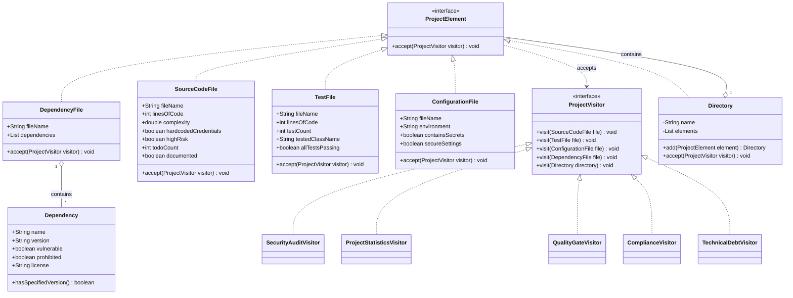

# Class Diagram

```mermaid
classDiagram
    direction TB

    class ProjectElement {
        <<interface>>
        +accept(ProjectVisitor visitor) void
    }

    class ProjectVisitor {
        <<interface>>
        +visit(SourceCodeFile file) void
        +visit(TestFile file) void
        +visit(ConfigurationFile file) void
        +visit(DependencyFile file) void
        +visit(Directory directory) void
    }

    class SourceCodeFile {
        +String fileName
        +int linesOfCode
        +double complexity
        +boolean hardcodedCredentials
        +boolean highRisk
        +int todoCount
        +boolean documented
        +accept(ProjectVisitor visitor) void
    }

    class TestFile {
        +String fileName
        +int linesOfCode
        +int testCount
        +String testedClassName
        +boolean allTestsPassing
        +accept(ProjectVisitor visitor) void
    }

    class ConfigurationFile {
        +String fileName
        +String environment
        +boolean containsSecrets
        +boolean secureSettings
        +accept(ProjectVisitor visitor) void
    }

    class DependencyFile {
        +String fileName
        +List dependencies
        +accept(ProjectVisitor visitor) void
    }

    class Directory {
        -String name
        -List elements
        +add(ProjectElement element) Directory
        +accept(ProjectVisitor visitor) void
    }

    class Dependency {
        +String name
        +String version
        +boolean vulnerable
        +boolean prohibited
        +String license
        +hasSpecifiedVersion() boolean
    }

    class SecurityAuditVisitor
    class ProjectStatisticsVisitor
    class QualityGateVisitor
    class ComplianceVisitor
    class TechnicalDebtVisitor

    ProjectElement <|.. SourceCodeFile
    ProjectElement <|.. TestFile
    ProjectElement <|.. ConfigurationFile
    ProjectElement <|.. DependencyFile
    ProjectElement <|.. Directory

    ProjectVisitor <|.. SecurityAuditVisitor
    ProjectVisitor <|.. ProjectStatisticsVisitor
    ProjectVisitor <|.. QualityGateVisitor
    ProjectVisitor <|.. ComplianceVisitor
    ProjectVisitor <|.. TechnicalDebtVisitor

    Directory "1" o-- "*" ProjectElement : contains
    DependencyFile "1" o-- "*" Dependency : contains
    ProjectElement ..> ProjectVisitor : accepts 
```