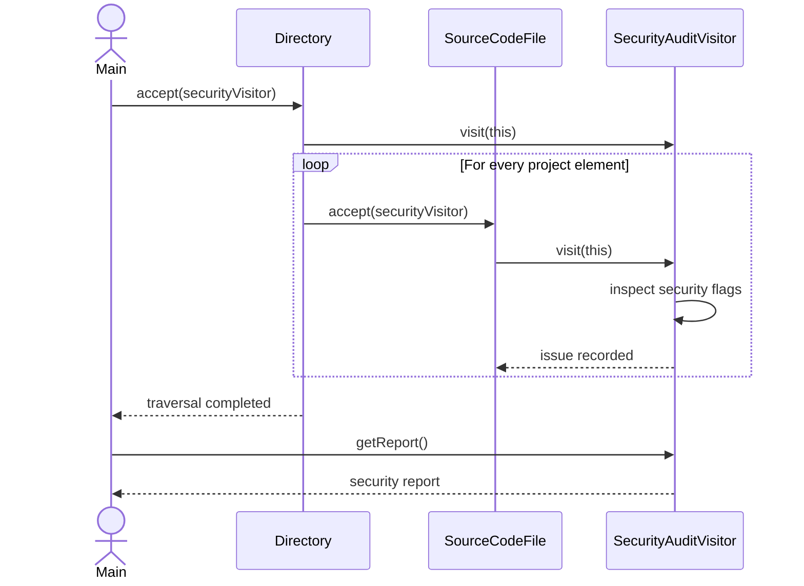

# Sequence Diagram

```mermaid
sequenceDiagram
    actor Main
    participant Directory
    participant SourceCodeFile
    participant SecurityAuditVisitor

    Main->>Directory: accept(securityVisitor)
    Directory->>SecurityAuditVisitor: visit(this)

    loop For every project element
        Directory->>SourceCodeFile: accept(securityVisitor)
        SourceCodeFile->>SecurityAuditVisitor: visit(this)
        SecurityAuditVisitor->>SecurityAuditVisitor: inspect security flags
        SecurityAuditVisitor-->>SourceCodeFile: issue recorded
    end

    Directory-->>Main: traversal completed
    Main->>SecurityAuditVisitor: getReport()
    SecurityAuditVisitor-->>Main: security report
```